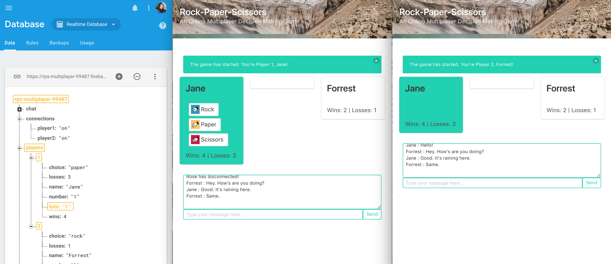
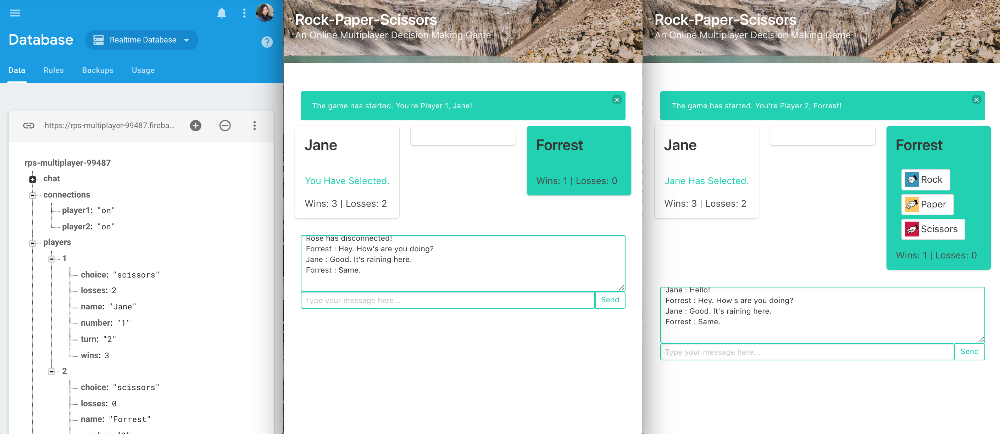
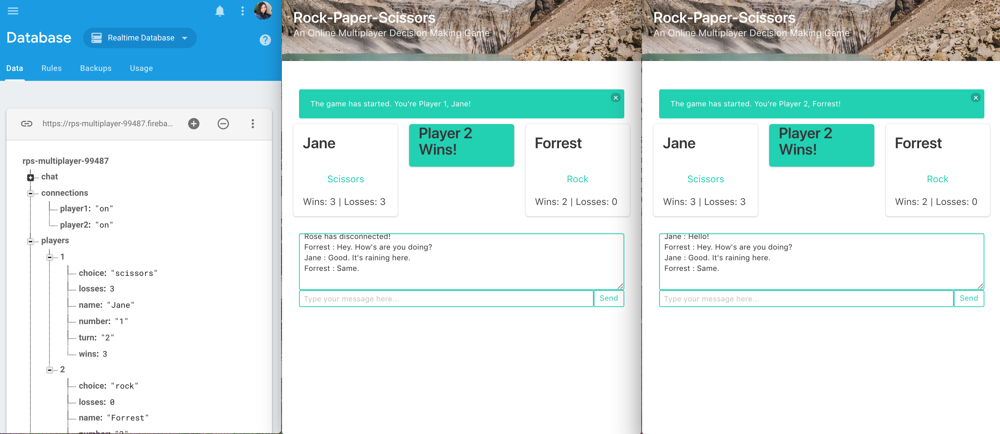

# RPS-Multiplayer

### Welcome to Rock-Paper-Scissors Multiplayer! Just like when we play this game at the playground, you won't be able to play it alone. So, be sure to grab a friend (or a second browser tab!). [Click to Play](https://keenwilson.github.io/RPS-Multiplayer/ "Rock-Paper-Scissors Multiplayer")
---
## User Story

* Only two users can play at the same time. 
* Once both users are connected to `firebase`, one of the user can _click a start button_ to start their first game. 
* Both players pick either rock, paper or scissors. Player 1 will make a decision first. 

*  After Player 1 has selected, `firebase` will store Player 1's choice on the database. Then, Player 2 could make a decision.

* After the players make their selection, the game will tell them whether a tie occurred or if one player defeated the other.
* The game will reveal each player's selected choice, track each player's wins and losses, and automatically start a next round in a few seconds.

---
##  Technical Approach
This app utilizes the concept of data-persistence and simple server-side (Firebase) approaches for storing data using `firebase.database.Reference` methods such as  `child`, `on`, `once`, `onDisconnect`, `set`, and `update`. 

### How this app is built
* Created an online _two-player Rock-Paper-Scissors_ game with the help of _Firebase_ to store and sync data between users and devices in realtime using `a cloud-hosted, NoSQL database`. 
* Utilized  `JavaScript` to build game logic and display results.
* Use  `Bulma CSS framework` to make development lifecycle faster and easier. 
* This app comes with chat functionality that users can send texts and see if the opponent has disconnected.
---

## Author

[Keen Wilson](https://github.com/keenwilson/keenwilson.github.io "Keen Wilson's Portfolio")

